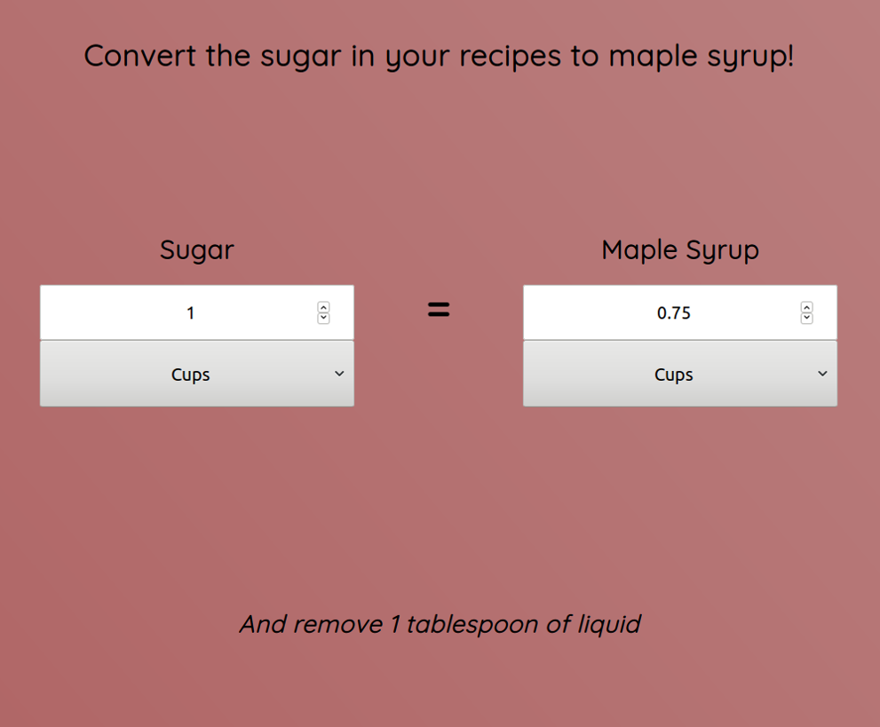

# Maple Syrup Conversion Tool

> A Conversion Tool for Baking and Cooking

<div align='center'>
  
</div><br>

## Demo

[View the Live Demo](https://andrewbaldwin44.github.io/Maple_Syrup_Conversion_Tool/)

## What is it?

A simple web tool to convert the amount of sugar used in recipes into maple syrup. This allows you to easily use maple syrup in just about any recipe!

## Features

1. A fully responsive design. Enjoy the app on any device!

## Deploy the project

__Clone the repo to your local machine using the terminal__:
```
$ git clone git@github.com:andrewbaldwin44/Maple_Syrup_Conversion_Tool.git
```

*Then Open the `index.html` Project File in Your Browser*

## Technologies Used:

- JavaScript
- HTML
- CSS

## Author

👤 **Andrew Baldwin**

- Github: [@andrewbaldwin44](https://github.com/andrewbaldwin44)
